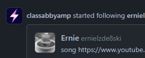
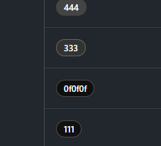
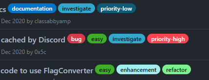
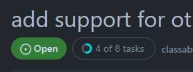
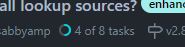
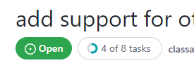
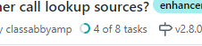

# Userstyles for Github

Click the links to install the styles

- [Square avatars](https://raw.githubusercontent.com/0x5c/userstyles/master/sites/github.com/gh-avatars-square.user.css)  
    Simple style to make github avatar square with customisable radius.  
    
- [Full colour labels for dark mode](https://raw.githubusercontent.com/0x5c/userstyles/master/sites/github.com/gh-labels-fullcolour.user.css)  
    Userstyle to bring the full colours of light theme labels to the dark themes. Customisable border threshold and transparency.  
     

- [Custom colours for issue tasks indicator](https://raw.githubusercontent.com/0x5c/userstyles/master/sites/github.com/gh-issue-tasks-indicator.user.css)  
    Userstyle to customise the colour of the issue tasks indicator.  
       
     
